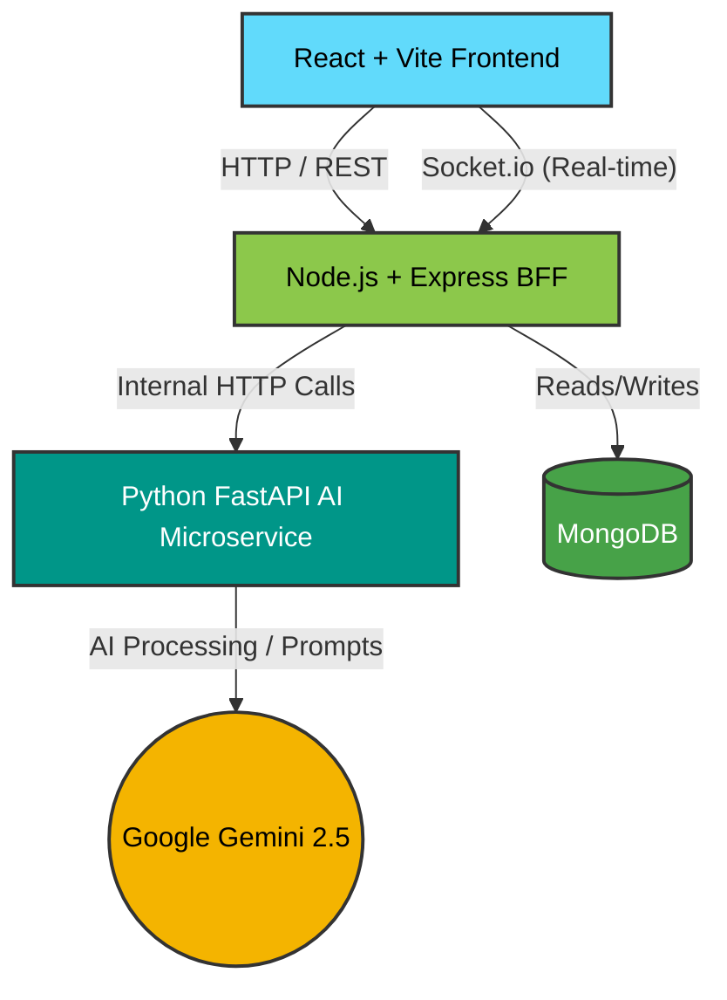

<div align="center">
  
  <h1>Lumina AI - Next-Gen Technical & Behavioral Interviewer</h1>

  <p>
    <strong>An advanced, scalable, and secure AI-driven mock interview platform.</strong><br>
    Designed to help candidates prepare for technical and behavioral interviews with real-time feedback, human-like voice synthesis, and deep AI performance analytics.
  </p>

  <p>
    
    
    
    
    
  </p>
</div>

---

## 🌟 Overview

Lumina AI acts as a sophisticated, dynamic interviewer. Candidates provide their resume and the Job Description (JD) they are targeting. The platform parses this data entirely in the browser, securely transmits it, and orchestrates an interview session. 

It generates role-specific technical coding challenges (evaluated in real-time using Monaco Editor), conceptual oral questions, and behavioral prompts (STAR method). Results are aggregated into an ATS match score and a highly detailed, AI-generated performance breakdown.

## 🚀 Key Features

* **Resume & JD Parsing (Browser-side)**: Secure, lightning-fast PDF parsing directly in the browser via `pdf.js` before data ever touches the network.
* **Microservices BFF Architecture**: Decoupled Node.js Backend-for-Frontend (BFF) and Python/FastAPI AI Microservice for independent scaling and failure isolation.
* **Real-time WebSockets**: Low-latency, bidirectional streaming of interview states, AI processing status, and real-time coding evaluations using `Socket.io`.
* **Enterprise-Grade Security**: 
  * Strict API Rate Limiting (`express-rate-limit`) to prevent abuse.
  * Native NoSQL Injection protection via Mongoose schema validation and casting.
  * Advanced HTTP Header protections (`helmet`) and strictly configured CORS policies.
* **High-Performance Caching**: In-memory `node-cache` invalidation strategies to heavily reduce database load during frequent Dashboard reloads.
* **Live Proctoring (Anti-Cheat)**: TensorFlow.js (COCO-SSD) integrated directly into the browser to monitor candidate integrity during the interview.
* **Containerized & CI/CD Ready**: Fully Dockerized environments (`Dockerfile`, `docker-compose.yml`) with automated GitHub Actions testing workflows.

## 🏗️ System Architecture

Lumina AI leverages a highly scalable **Backend-for-Frontend (BFF)** architectural pattern:



## 🛠️ Technology Stack

### Frontend (Vercel)
- **Framework**: React 19 + Vite
- **Styling**: Tailwind CSS + PostCSS
- **State Management**: Redux Toolkit
- **Code Editor**: Monaco Editor (`@monaco-editor/react`)
- **PDF Processing**: `pdfjs-dist`
- **Machine Learning**: TensorFlow.js (COCO-SSD)

### Backend (Render)
- **Framework**: Node.js + Express 5
- **Database**: MongoDB (Mongoose)
- **Caching**: `node-cache`
- **Security**: `helmet`, `express-rate-limit`
- **Real-time**: `socket.io`

### AI Service (Render)
- **Framework**: Python + FastAPI
- **LLM Engine**: Google GenAI SDK (`gemini-2.5-flash`)
- **Voice Synthesis (TTS)**: `edge-tts` (Microsoft Edge Neural Voices)
- **Audio Processing**: `pydub`, `python-multipart`

## 📂 Project Structure

```text
.
├── frontend/             # React/Vite UI & Client-side parsing
├── backend/              # Node.js BFF, Database schemas, Auth, WebSockets
├── ai-service/           # Python FastAPI for heavy LLM & Audio workloads
├── docker-compose.yml    # Local development orchestration
└── .github/workflows/    # CI/CD pipelines
```

---

## 💻 Local Development Setup (Docker)

The absolute fastest way to run Lumina AI locally is via Docker Compose. 

### Prerequisites
- Docker & Docker Compose
- Google Gemini API Keys
- MongoDB URI

### 1. Environment Variables
Create a `.env` file in the root directory (or inside each specific folder as defined below):

**`backend/.env`**
```env
MONGO_URI=mongodb://localhost:27017/lumina
PORT=5000
FRONTEND_URL=http://localhost:5173
JWT_SECRET=supersecretjwtkey
GOOGLE_CLIENT_ID=your_google_client_id
AI_SERVICE_URL=http://ai-service:8000
```

**`ai-service/.env`**
```env
AI_SERVICE_PORT=8000 
GOOGLE_API_KEY1=your_api_key_here
GOOGLE_API_KEY2=your_api_key_here
```

**`frontend/.env`**
```env
VITE_API_URL=http://localhost:5000/api
VITE_GOOGLE_CLIENT_ID=your_google_client_id
```

### 2. Run the Cluster
From the root of the project, execute:
```bash
docker-compose up --build
```
This will automatically build and orchestrate the Node.js backend, Python FastAPI service, and your local MongoDB instance. 

*Note: The frontend should be run locally using `npm run dev` in the `frontend/` directory for HMR (Hot Module Replacement).*

---

## ☁️ Cloud Deployment (Free Tier)

This architecture is deeply optimized to run efficiently on free-tier cloud providers.

### 1. Database (MongoDB Atlas)
- Create a free cluster on [MongoDB Atlas](https://www.mongodb.com/cloud/atlas).
- Whitelist network access (`0.0.0.0/0`).

### 2. AI Service (Render)
- Deploy `ai-service` as a **Web Service** on [Render](https://render.com).
- **Build Command**: `pip install -r requirements.txt && apt-get update && apt-get install -y ffmpeg`
- **Start Command**: `uvicorn main:app --host 0.0.0.0 --port $PORT`

### 3. Node.js Backend (Render)
- Deploy `backend` as a **Web Service** on Render.
- **Build Command**: `npm install`
- **Start Command**: `npm start`
- *Set `MONGO_URI`, `AI_SERVICE_URL`, and `FRONTEND_URL` in the Dashboard.*

### 4. Frontend (Vercel)
- Deploy `frontend` on [Vercel](https://vercel.com).
- *Set `VITE_API_URL` to your Render Backend URL.*

## 📄 License
ISC License
